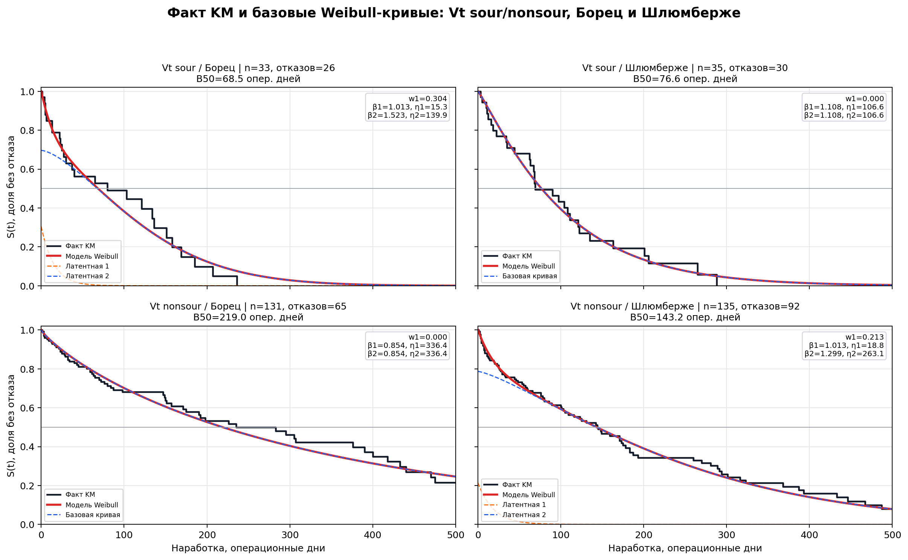

# Модель прогноза отказов УЭЦН

Черновик отдельного пояснительного листа для Excel.

## 1. Базовая модель надежности

Базовая модель отвечает на вопрос: **как быстро насос отказывает в обычных условиях для своей группы скважин**.

Модель строится не одна на весь парк, а по стратам. Страта - это комбинация:

- месторождение / модельное поле: `Ya`, `Vt`, `Ic`, `Az`, `Mc`, `Da`;
- кислотность: `sour` / `nonsour`;
- подрядчик / тип поставщика: `brt`, `slb`, `oth`, `Pooled`.

Группы подрядчиков:

| Код | Расшифровка |
|---|---|
| `brt` | Борец |
| `slb` | Шлюмберже |
| `oth` | прочие подрядчики |
| `Pooled` | объединенная группа, если отдельной статистики недостаточно |

Пример страты:

```text
Vt_sour_brt = Верхнетирский участок + кислые условия + Борец
Vt_nonsour_slb = Верхнетирский участок + некислые условия + Шлюмберже
```

Иллюстрация для вставки в Excel: факт KM, базовая Weibull-модель, латентные компоненты и параметры распределений только для четырех кривых `Vt_sour_brt`, `Vt_sour_slb`, `Vt_nonsour_brt`, `Vt_nonsour_slb`.



### Что такое latent groups

Внутри каждой страты модель может использовать **две скрытые группы отказов**:

- **Группа 1 / ранние отказы** - часть насосов, которая чаще отказывает рано.
- **Группа 2 / основной ресурс / износ** - насосы, которые живут дольше и отказывают позже.

Это не вручную размеченные причины отказа. Это статистическое разложение кривой выживаемости на две Weibull-компоненты.

Формула базовой кривой выживаемости:

```text
S(t) = w1 * exp(-(t / eta1)^beta1)
     + (1 - w1) * exp(-(t / eta2)^beta2)
```

Где:

| Параметр | Простой смысл |
|---|---|
| `w1` | доля ранней группы отказов |
| `beta` | форма кривой: как меняется риск с возрастом насоса |
| `eta` | масштаб ресурса: чем больше `eta`, тем медленнее падает надежность |
| `B50` | возраст, к которому ожидаемо отказало 50% насосов этой страты |

Интерпретация `beta`:

| Значение beta | Смысл |
|---|---|
| `beta < 1` | высокий риск в начале, затем риск снижается |
| `beta ≈ 1` | риск примерно постоянный |
| `beta > 1` | риск растет с возрастом, эффект износа |

Если данных для двух групп недостаточно или смесь не улучшает качество, модель сворачивается к одной Weibull-кривой. В таком случае `w1 = 0`, а параметры `beta1/eta1` и `beta2/eta2` одинаковые.

### Пример: Vt sour / nonsour

Текущие параметры из bundle `2026-07-13`.

| Страта | Тип модели | w1 | beta1 | eta1 | beta2 | eta2 | B50, опер. дней | Запусков | Отказов |
|---|---:|---:|---:|---:|---:|---:|---:|---:|---:|
| `Vt_sour_brt` | k2 | 0.304 | 1.013 | 15.3 | 1.523 | 139.9 | 68.5 | 33 | 26 |
| `Vt_sour_slb` | k1 | 0.000 | 1.108 | 106.6 | 1.108 | 106.6 | 76.6 | 35 | 30 |
| `Vt_nonsour_brt` | k1 | 0.000 | 0.854 | 336.4 | 0.854 | 336.4 | 219.0 | 131 | 65 |
| `Vt_nonsour_slb` | k2 | 0.213 | 1.013 | 18.8 | 1.299 | 263.1 | 143.2 | 135 | 92 |

Главная идея примера:

- кислые условия `Vt_sour` дают более короткую жизнь насосов;
- некислые `Vt_nonsour` в среднем живут дольше;
- подрядчик также важен: внутри одного поля и одной кислотности кривые могут заметно отличаться.

## 2. Hazard layer

Базовая Weibull-модель описывает среднюю надежность для страты. Но конкретный насос может работать лучше или хуже среднего из-за режима эксплуатации и истории.

Для этого сверху применяется **hazard layer** - корректировка риска отказа по факторам.

Принцип простой:

```text
theta = exp( beta_1 * (x_1 - ref_1)
           + beta_2 * (x_2 - ref_2)
           + ... )
```

Где:

- `x` - значение фактора для конкретного запуска;
- `ref` - среднее / базовое значение фактора;
- `beta` - вес фактора;
- `theta` - множитель риска.

Интерпретация:

| theta | Что означает |
|---|---|
| `theta = 1` | риск как в базовой кривой |
| `theta > 1` | риск выше, кривая отказов сдвигается раньше |
| `theta < 1` | риск ниже, кривая отказов сдвигается позже |

Технически это применяется как пересчет масштаба `eta` для каждой Weibull-компоненты:

```text
eta_new = eta_base / theta^(1 / beta)
```

То есть форма кривой `beta` остается той же, а ресурсный масштаб `eta` сжимается или растягивается.

### Факторы hazard layer

| Фактор | Что учитывает | Как влияет в модели |
|---|---|---|
| `GLF` | газожидкостный фактор | влияет на гидравлический режим |
| `load_variability` | нестабильность загрузки двигателя | больше нестабильности - выше риск |
| `load_level` | средний уровень загрузки двигателя | корректирует электротепловой режим |
| `chronic_underload` | доля времени с низким коэффициентом подачи | хроническая недогрузка повышает риск |
| `delivery_coef` | средний коэффициент подачи | отражает эффективность режима |
| `freq_above_55hz` | доля времени на частоте выше 55 Гц | высокая частота повышает риск |
| `freq_instability` | количество изменений частоты | нестабильный режим повышает риск |
| `curvature` | кривизна ствола | поправка на условия спуска / компоновку |
| `run_seq` | номер спуска на скважине | история повторных спусков влияет на риск |
| `days_since_fail` | время с предыдущего отказа | учитывает историю ремонтов |
| `vintage_pre2020` | старые установки до 2020 года | поправка на винтаж / поколение запусков |
| `vintage_2023plus` | новые установки 2023+ | поправка на новый режим / новый парк |

Важно: hazard layer не заменяет базовую модель. Он только корректирует базовую кривую конкретного запуска.

## 3. Как строится прогноз отказов

Прогноз отказов строится по каждой скважине и каждому месяцу горизонта.

### Шаг 1. Определяем состояние насоса на дату старта прогноза

Для каждой скважины определяется текущий насос:

- когда он был смонтирован;
- сколько уже наработал;
- работает ли он сейчас;
- есть ли данные из текущего технологического режима;
- к какой страте относится скважина.

Если точная наработка известна, используется она. Если нет, возраст насоса восстанавливается статистически по похожим насосам этой же страты или поля.

### Шаг 2. Берем базовую кривую надежности

По коду скважины выбирается модельное поле:

```text
YA -> Ya
VT -> Vt
IC -> Ic
MC/MR -> Mc
AZ -> Az
DA -> Da
```

`NE` здесь намеренно не отнесен к `Mc`: по нему нужна отдельная проверка, поэтому в этом пояснительном листе он не используется как часть `Mc`.

Затем уточняется:

- sour / nonsour;
- подрядчик `brt`, `slb`, `oth` или `Pooled`.

Так получается строка модели, например:

```text
Vt_sour_brt
Vt_nonsour_slb
Mc_nonsour_Pooled
```

### Шаг 3. Применяем hazard layer

Если для запуска есть эксплуатационные признаки, базовая кривая корректируется:

```text
базовая кривая -> theta -> скорректированная кривая
```

Если признаки недоступны, используется базовая кривая без индивидуальной поправки.

### Шаг 4. Считаем вероятность отказа по дням

Модель работает на операционном времени. Для каждого дня считается условная вероятность отказа:

```text
q(age) = 1 - S(age + 1) / S(age)
```

Где `age` - текущая наработка насоса в операционных днях.

Дальше насос "стареет" только в дни, когда по плану есть работа. Если скважина не работает, возраст насоса не растет.

### Шаг 5. Учитываем замену после отказа

Когда в прогнозе появляется ожидаемый отказ:

- насос уходит в ремонт / простой на сценарное число дней;
- после ремонта возвращается новый насос с возрастом 0;
- дальше для него снова считается риск отказа.

Так модель может учитывать несколько возможных отказов на длинном горизонте.

### Шаг 6. Агрегируем результат

По всем скважинам суммируются:

- ожидаемое число отказов по месяцам;
- потери добычи;
- риск по месторождениям / `УН`;
- глобальный риск по флоту.

В repair workbook дополнительно формируется совместимый лист `Repair forecast`:

- `0` - день прогнозного отказа;
- `1` - любой другой день.

Это именно разметка событий отказа. Период ремонта в этой сетке не закрашивается.

## 4. Как считается интенсивность отказов

Интенсивность отказов нужна для проверки модели на истории и для понятного графика для клиента.

Формула:

```text
интенсивность = число отказов / активный добывающий парк
```

Активный добывающий парк в месяце - это скважины, где:

- `Отработанное время > 0`;
- и есть добыча нефти или жидкости.

Для истории сравниваются:

- факт: реальные отказы из `Свод` + `WellsArtificialLiftBig`;
- модель: прогноз Weibull по фактическим датам монтажа насосов.

После последнего полного фактического месяца факт не показывается. Сейчас последний полный месяц:

```text
2026-04
```

Дальше на графиках остается только прогноз модели.

## 5. Что важно помнить

- Базовая модель - это средняя надежность для страты.
- Hazard layer - индивидуальная поправка к этой средней кривой.
- Прогноз отказов считается по насосам, с учетом текущего возраста и замены после отказа.
- Интенсивность отказов - это проверочный слой: насколько модельная частота отказов похожа на фактическую.
- Малые поля остаются в audit-таблице, но их графики могут не выводиться, чтобы лист Excel не был перегружен шумом.
